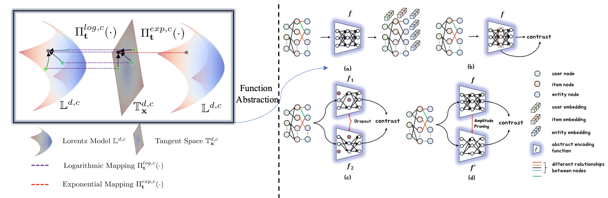

## Hyperbolic Contrastive Learning with Model-Augmentation for Knowledge-Aware Recommendation (HCMKR)

This is the Pytorch implementation for our *ECML-PKDD'24* paper: **Hyperbolic Contrastive Learning with Model-Augmentation for Knowledge-Aware Recommendation**. The overall framwork is as follows:



## Enviroment Requirement
    # More details can be seen in ./code/packages.txt.
    torch==1.8.1+cu111 
    torch-cluster==1.5.9  
    torch-scatter==2.0.6  
    torch-sparse==0.6.11  
    torch-spline-conv==1.2.1  
    torch-geometric==1.7.2

## Dataset

We provide three [processed datasets](https://drive.google.com/file/d/1qQpQL02qzmLN5DWQ204o4h-gV3y9D2hs/view?usp=sharing) (yelp2018, amazon-book, and ml-20m). You can download them from link, and put them in the file ./code.

## Run the Code
    cd code && bash performance.sh

## Acknowledgment of Open-Source Code Contributions  

  The code is based on the open-source repositories: [LightGCN](https://github.com/gusye1234/LightGCN-PyTorch) and [KGCL](https://github.com/yuh-yang/KGCL-SIGIR22), many thanks to the authors! 

You are welcome to cite our paper:
```
@inproceedings{hcmkr2024,
  author = {Sun, Shengyin and Ma, Chen},
  title = {Hyperbolic Contrastive Learning with Model-Augmentation for Knowledge-Aware Recommendation},
  year = {2024},
  booktitle = {Machine Learning and Knowledge Discovery in Databases},
  pages = {199–217}
}
```
