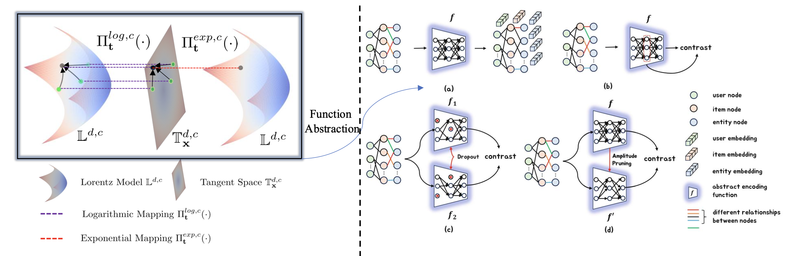

## Hyperbolic Contrastive Learning with Model-Augmentation for Knowledge-Aware Recommendation (HCMKR)


[](https://arxiv.org/html/2505.08157v1)
[](https://ecmlpkdd.org/2024/)
[](https://pytorch.org/)

This is the Pytorch implementation for our *ECML-PKDD'24* paper: [**Hyperbolic Contrastive Learning with Model-Augmentation for Knowledge-Aware Recommendation**](https://arxiv.org/abs/2505.08157). 

## Abstract
<div style="text-align: justify;">
Benefiting from the effectiveness of graph neural networks (GNNs) and contrastive learning, GNN-based contrastive learning has become mainstream for knowledge-aware recommendation. However, most existing contrastive learning-based methods have difficulties in effectively capturing the underlying hierarchical structure within user-item bipartite graphs and knowledge graphs. Moreover, they commonly generate positive samples for contrastive learning by perturbing the graph structure, which may lead to a shift in user preference learning. To overcome these limitations, we propose hyperbolic contrastive learning with model-augmentation for knowledge-aware recommendation. To capture the intrinsic hierarchical graph structures, we first design a novel Lorentzian knowledge aggregation mechanism, which enables more effective representations of users and items. Then, we propose three model-level augmentation techniques to assist Hyperbolic contrastive learning. Different from the classical structure-level augmentation (e.g., edge dropping), the proposed model-augmentations can avoid preference shifts between the augmented positive pair. The overall framework is as follows:
<div> 
<br>



## Environment Requirement
    # More details can be seen in ./code/packages.txt.
    torch==1.8.1+cu111 
    torch-cluster==1.5.9  
    torch-scatter==2.0.6  
    torch-sparse==0.6.11  
    torch-spline-conv==1.2.1  
    torch-geometric==1.7.2

## Dataset

We provide three processed datasets (yelp2018, amazon-book, and ml-20m). You can download them from [link](https://drive.google.com/file/d/1qQpQL02qzmLN5DWQ204o4h-gV3y9D2hs/view?usp=sharing), and put them in the file ./code.

## Run the Code
    cd code && bash performance.sh

## Acknowledgment of Open-Source Code Contributions  

  The code is based on the open-source repositories: [LightGCN](https://github.com/gusye1234/LightGCN-PyTorch) and [KGCL](https://github.com/yuh-yang/KGCL-SIGIR22), many thanks to the authors! 

You are welcome to cite our paper:
```
@inproceedings{SunMa25,
  author = {Sun, Shengyin and Chen, Ma},
  title = {Hyperbolic Contrastive Learning with Model-Augmentation for Knowledge-Aware Recommendation},
  year = {2024},
  booktitle = {Machine Learning and Knowledge Discovery in Databases},
  pages = {199–217}
}
```
